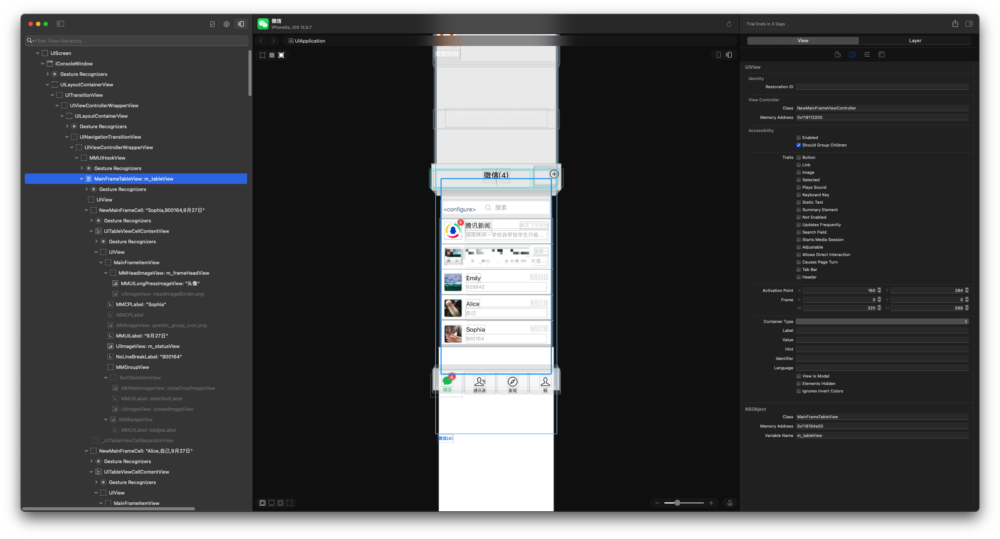
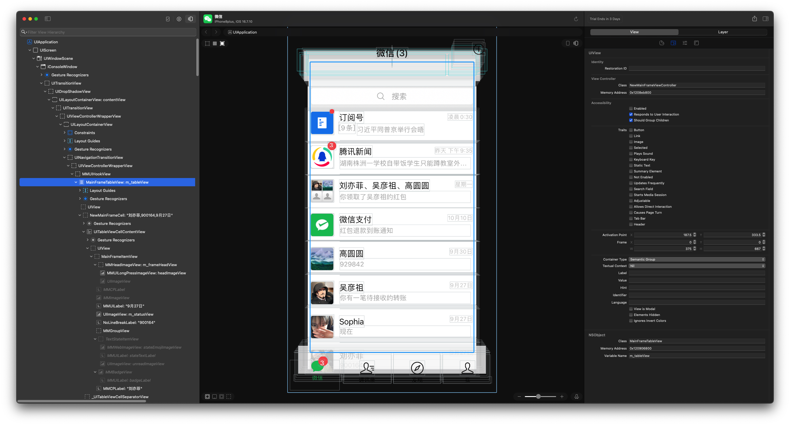

# RevealLoader2

[RevealLoader](https://github.com/heardrwt/RevealLoader) 的升级版，增加了对 rootless 越狱设备的支持。理论上支持的版本是 iOS 7.0 - iOS 17.5。但是作者只有 iOS 12.5.7 的 rootful 越狱和 iOS 16.7.10 的 rootless 越狱设备。都已成功运行。

<!--其实对于越狱开发来说，目前更推荐使用 Lookin 查看 UI ，Lookin 支持命令调试，可以直接在 Lookin 调试 UI。Lookin Loader 作者也已经发布并开源了。-->

使用的 RevealServer.framework 版本是 Version 46。如果版本不符合你电脑上的 Reveal 版本，可以自行替换：

1. 对于 rootful 越狱，你可以将你 Mac 电脑上 Reveal 的 RevealServer.framework 安装到越狱设备的 /Library/Frameworks 下
2. 对于 rootless 越狱，将 Mac 电脑上 Reveal 的 RevealServer.framework        安装到越狱设备的 /var/jb/Library/Frameworks 下

iOS 12.5.7 截图：

iOS 16.7.10 截图：

# 如何使用

可以使用两种方式安装

1. 添加[软件源](https://github.com/masterKing/sileo/blob/main/)，点击安装使用
2. 下载源码，自行编译安装使用